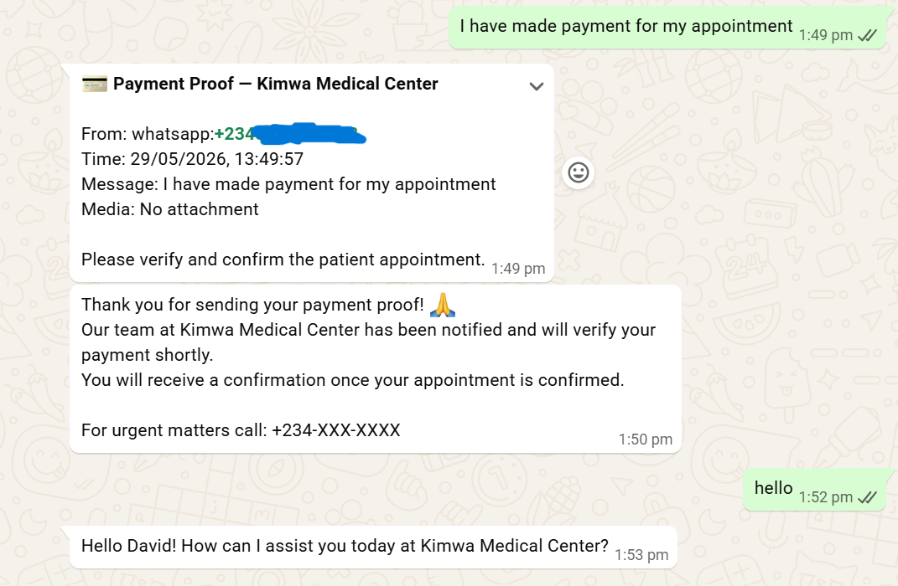
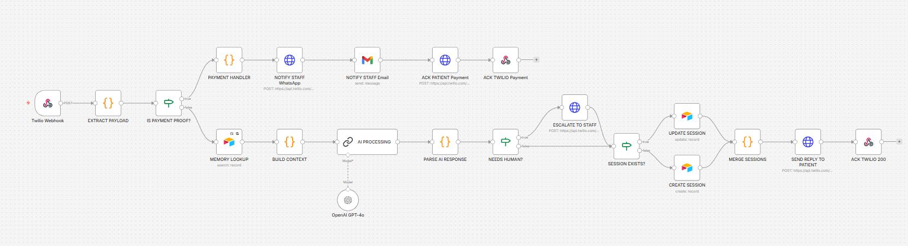

# 🤖 Kimwa Bot — AI-Powered WhatsApp Healthcare Assistant
---


> *A production-ready AI healthcare assistant that automates patient enquiries, appointment booking, payment verification workflows, and staff notifications using WhatsApp, OpenAI, n8n, Twilio, and Airtable.*


---

## 📌 Project Overview

Kimwa Bot is a production-ready WhatsApp-based healthcare assistant designed to automate the patient journey from initial enquiry to appointment booking, payment verification, and staff escalation.

The project was inspired by real operational challenges I encounter daily as a Medical Administrator in a private fertility clinic in Lagos, Nigeria.

Rather than building a generic chatbot, I designed a healthcare-focused AI workflow capable of handling appointment enquiries, doctor availability requests, payment notifications, patient memory, and staff alerts in a single automated system.

The goal is simple:

## 🎥 Demo Video

Watch the full project demonstration here:

https://youtu.be/Fucdjed0I38

**Reduce administrative workload, improve patient experience, and make healthcare services more accessible through intelligent automation.**

---

## 🚨 The Problem

Healthcare facilities often struggle with:

| Problem                                  | Business Impact                                 |
| ---------------------------------------- | ----------------------------------------------- |
| Delayed responses to patient enquiries   | Missed appointments and poor patient experience |
| Manual appointment scheduling            | Increased administrative workload               |
| Lost or unverified payment notifications | Delayed appointment confirmations               |
| Repetitive patient questions             | Staff burnout and reduced productivity          |
| Lack of centralized conversation history | Poor continuity of patient interactions         |

These operational challenges are common across many healthcare facilities and directly affect efficiency, revenue, and patient satisfaction.

---

## 💡 The Solution

Kimwa Bot combines AI-powered conversations with workflow automation to provide:

* Instant patient responses via WhatsApp
* Intelligent appointment booking support
* Doctor availability checks
* Persistent patient memory
* Automated payment verification notifications
* Human escalation when required
* Centralized patient session management

The result is a healthcare assistant capable of operating 24/7 while reducing manual administrative effort.

---

## 🏆 Project Highlights

✅ Production-ready deployment

✅ End-to-end AI workflow automation

✅ WhatsApp integration using Twilio

✅ OpenAI GPT-4o powered conversations

✅ Persistent patient memory

✅ Airtable-powered session management

✅ Automated staff notifications

✅ Email and WhatsApp payment alerts

✅ Human escalation workflow

✅ Real healthcare use case

---

## 🏗️ System Architecture

```text
Patient
   ↓
WhatsApp
   ↓
Twilio
   ↓
n8n Workflow Engine
   ↓
OpenAI GPT-4o
   ↓
Airtable Memory Layer
   ↓
Staff Notifications
   ↓
Patient Response
```

---

## 🛠️ Tech Stack

| Technology    | Purpose                            |
| ------------- | ---------------------------------- |
| WhatsApp      | Patient communication              |
| Twilio        | Messaging gateway                  |
| n8n           | Workflow automation                |
| OpenAI GPT-4o | Natural language understanding     |
| Airtable      | Patient memory and session storage |
| Gmail         | Automated staff notifications      |

---

## 🎯 Business Value

This solution helps healthcare facilities:

* Improve patient response times
* Reduce administrative workload
* Automate appointment booking workflows
* Improve payment verification processes
* Maintain patient conversation history
* Increase operational efficiency
* Deliver better patient experiences

---

## 🚀 Current Status

### Production Ready ✅

The system has been successfully tested with:

* Appointment enquiries
* Doctor availability requests
* Appointment booking workflows
* Payment notification workflows
* Staff escalation workflows
* Persistent memory functionality
* Airtable session management

---

## 🔮 Future Roadmap

* Appointment reminder automation
* Google Calendar integration
* Voice AI integration
* EMR integration
* Analytics dashboard
* Multi-clinic deployment
* Multi-language support (Yoruba, Igbo, Pidgin)

---
---

## 📸 Project Screenshots

### WhatsApp Patient Interaction




### n8n Workflow Architecture




### Airtable Session Memory


### Payment Verification Email


## 👤 About the Builder

Built by **Nenkimwa Simon Gokop**

Medical Administrator | Certified AI Automation Engineer | Healthcare Analytics Enthusiast

With firsthand experience managing healthcare operations, patient interactions, appointments, and insurance processes, I am passionate about applying AI and automation to solve real-world healthcare challenges.

📍 Lagos, Nigeria

🔗 GitHub: https://github.com/NenKimwa

🔗 LinkedIn: https://www.linkedin.com/in/nenkimwagokop

📧 [nenkimwagokop3@gmail.com](mailto:nenkimwagokop3@gmail.com)

▶️ Watch the Demo: https://youtu.be/Fucdjed0I38

---

> *"Built from real healthcare experience. Designed for real healthcare impact."*
